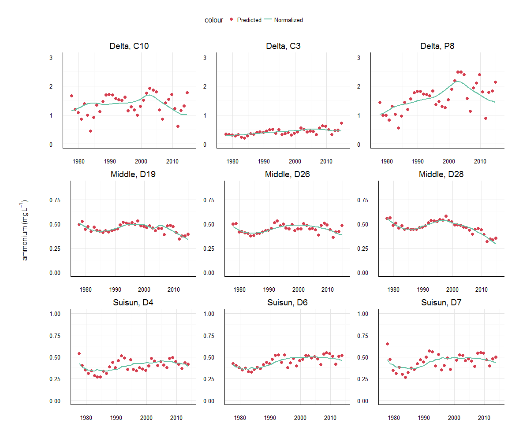
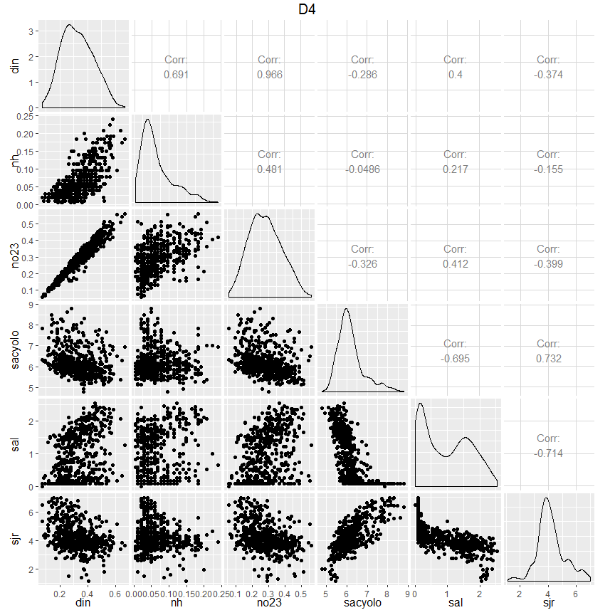
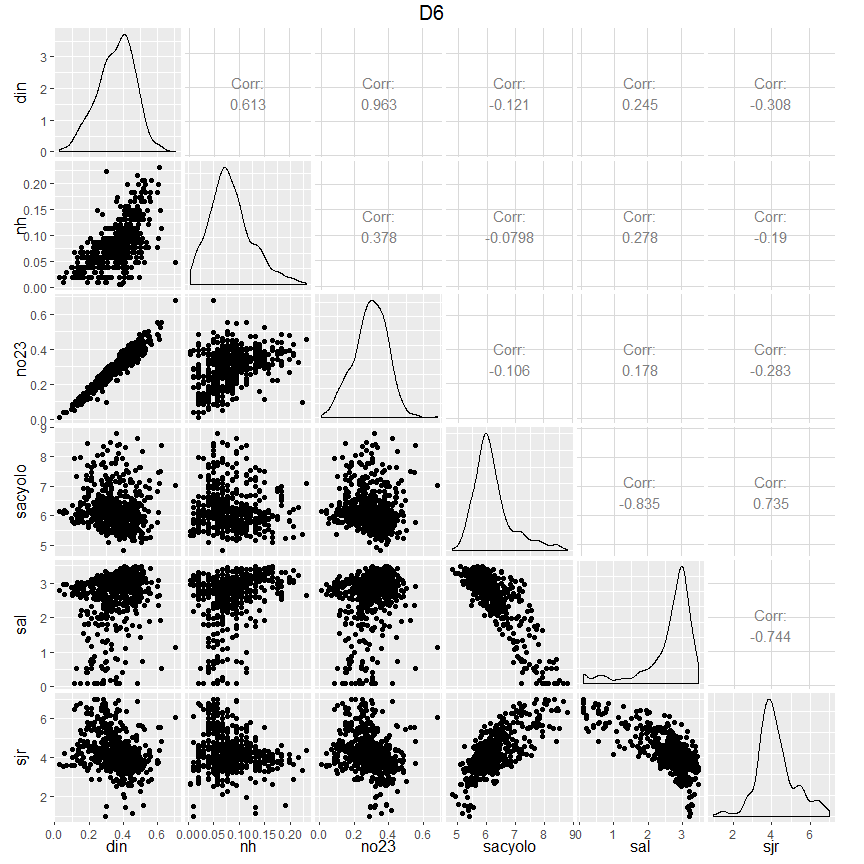
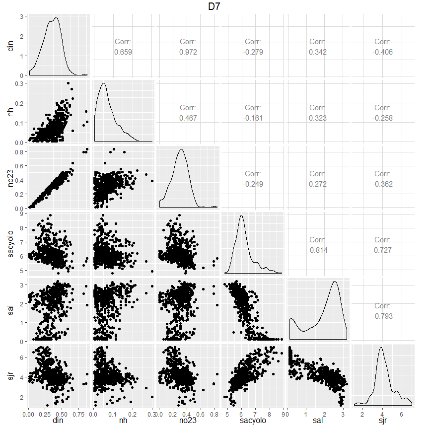
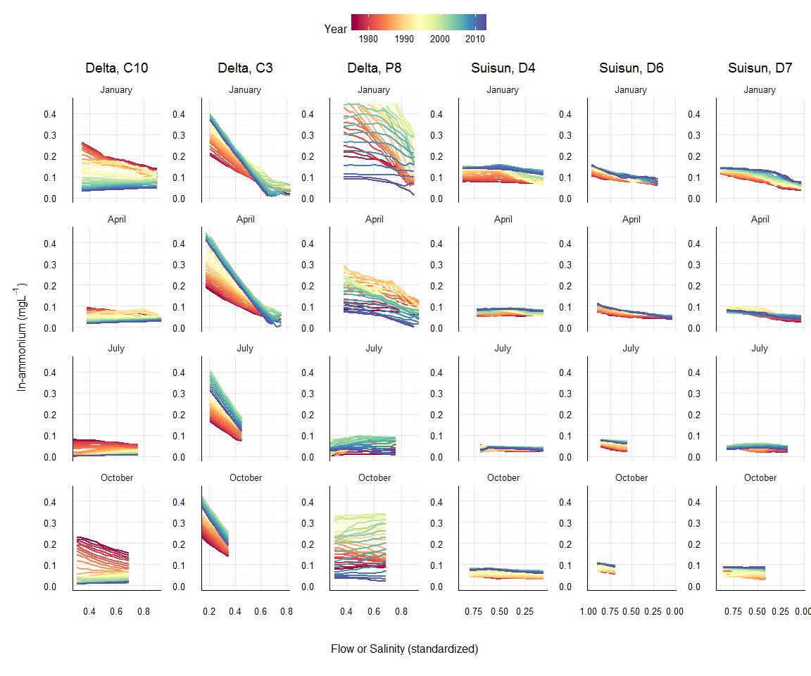
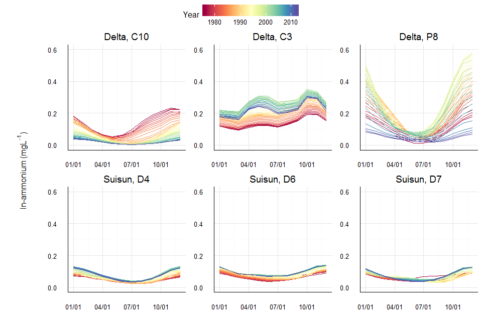

# README
Marcus W. Beck, beck.marcus@epa.gov  

### Files

**_data/_** Supporting RData files, usually from data in ignore folder, unless otherwise noted all files were created in `R/dat_proc.R`

* `bests.RData` subset of `flocor.RData` for min or max cor of each nut parm with flow or sal time series, respectively.  Each site is matched with the flow or salinity record ided in figure 10 of Novick et al

* `delt_dat.RData` Processed wq time series data `dwr_wq.RData`, includes all nitrogen analytes and current/active stations in the delta, also includes matched and smoothed flow records from `flocor.RData` results

* `dwr_wq.RData` time series data of stations in the SF delta from California DWR-EMP (Department of Water Resources, Environmental Monitoring Program) , processed by E. Novick, all stations, analytes from 1975 to present.  Most analytes are measured as concentration, see original spreadsheet for values.  Unavailable in GitHub repo.

* `flocor.RData` results of ccf analysis of selected delta and suisun stations comparing nitrogen and flow

* `flow_dat.RData` time series of daily flow estimates for the delta, input stations from Novick et al (Fig 2) were used

* `nutcor.RData` results of ccf analysis of selected delta and suisun stations comparing nitrogen species

* `mods.RData` dataset for wrtds, including model results. This is a nested data frame with identifiers.  All response, flow values are ln + 1 transformed, flow (or salinity) records for each nutrient variable and station are combined based on the monthly lag ided from `bests.RData`

**_R/_** Supporting R scripts

**_text/_** Summary text of analyses

### Comparing time series of nutrients and flow for selected stations

Monthly nutrient samples at selected stations were compared with flow estimates to characterize variation in time series correlations. Time series were compared using cross-correlation analysis with lags +/- 12 months.  Selected stations from the delta were C10, C, and P8 and selected stations from Suisun were D4, D6, and D7.  Flow estimates from Novick et al. were the Sacramento River plus Yolo bypass (`sacyolo = sac + yolo`),  San Joaquin River (`sjr`).  Nutrient data were also compared with salinity observations at each station.  Nitrogen species evaluated included dissolved inorganic nitrogen (`din`), ammonium (`nh`), and nitrite/nitrate (`no23`). 

  
The above analysis was repeated to compare temporal variation of nitrogen species.  

### Matching stations to flow or salinity records

|Site_Code |Location |resvar |flovar      | lag|        acf|
|:---------|:--------|:------|:-----------|---:|----------:|
|C10       |Delta    |din    |San Joaquin |   0| -0.6269706|
|C10       |Delta    |nh     |San Joaquin |  -4| -0.2451807|
|C10       |Delta    |no23   |San Joaquin |   0| -0.6472901|
|C3        |Delta    |din    |Sacramento  |   0| -0.5077493|
|C3        |Delta    |nh     |Sacramento  |   0| -0.6839323|
|C3        |Delta    |no23   |Sacramento  |  -3| -0.2711726|
|P8        |Delta    |din    |San Joaquin |   0| -0.4151813|
|P8        |Delta    |nh     |San Joaquin |  -3| -0.1764686|
|P8        |Delta    |no23   |San Joaquin |   0| -0.4724534|
|D4        |Suisun   |din    |Salinity    |  -2|  0.5440757|
|D4        |Suisun   |nh     |Salinity    |  -2|  0.4444447|
|D4        |Suisun   |no23   |Salinity    |  -2|  0.5116835|
|D6        |Suisun   |din    |Salinity    |  -2|  0.4363288|
|D6        |Suisun   |nh     |Salinity    |  -1|  0.4233493|
|D6        |Suisun   |no23   |Salinity    |  -2|  0.3697885|
|D7        |Suisun   |din    |Salinity    |  -3|  0.5189457|
|D7        |Suisun   |nh     |Salinity    |  -2|  0.4753318|
|D7        |Suisun   |no23   |Salinity    |  -3|  0.4664261|
Sites were matched with flow or salinity records based on flow contributions in Novick et al.  Weighted regression models were run for each station and each nutrient species of nitrogen.   

### To do 

* get detection limits

