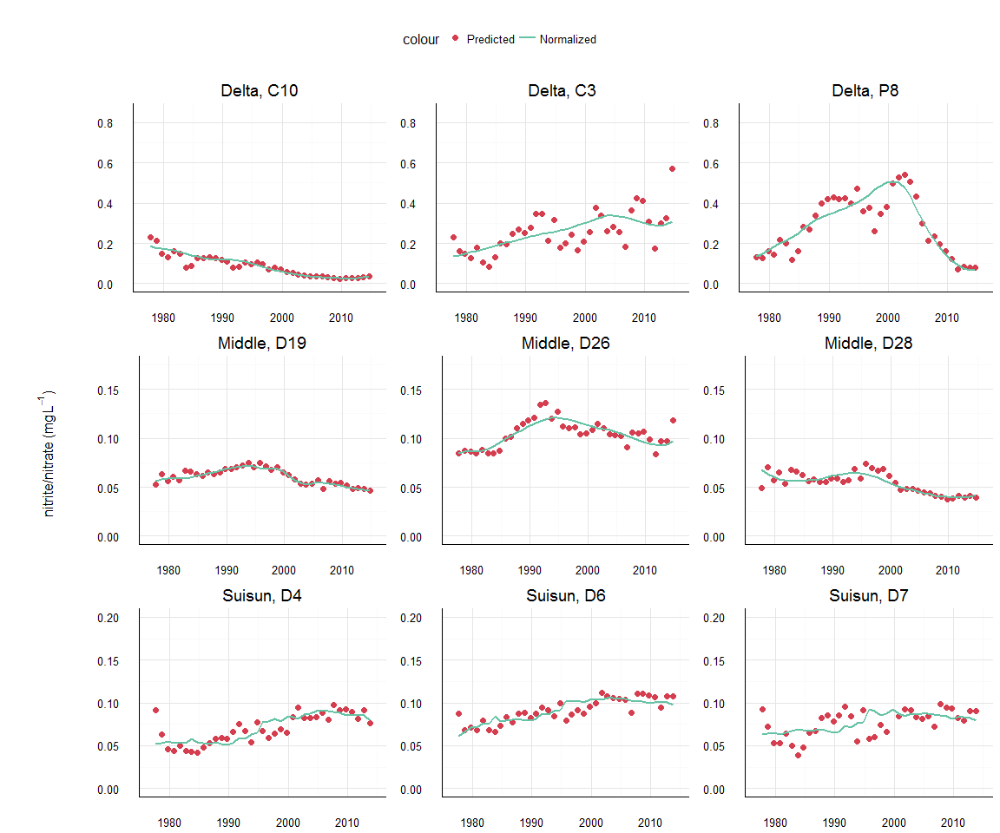
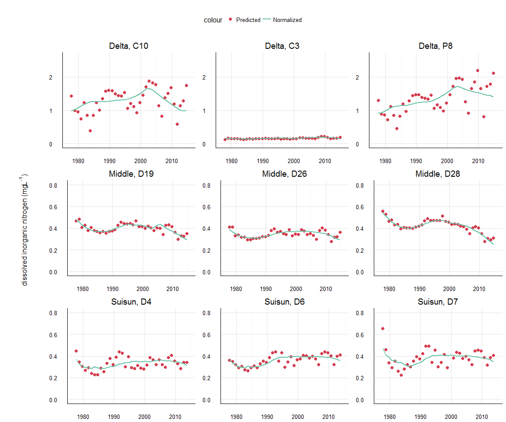
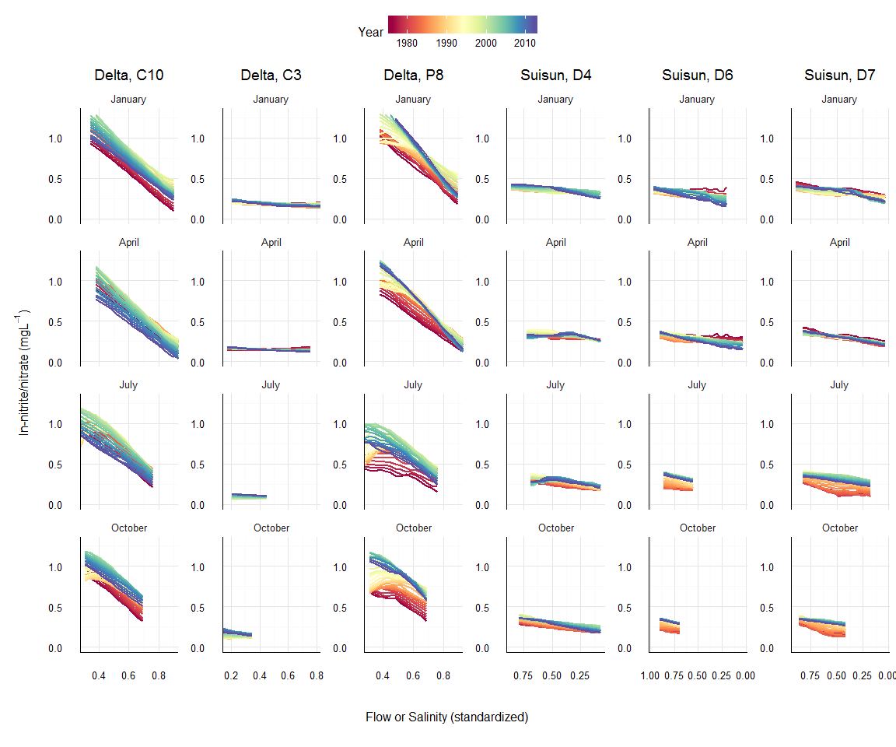
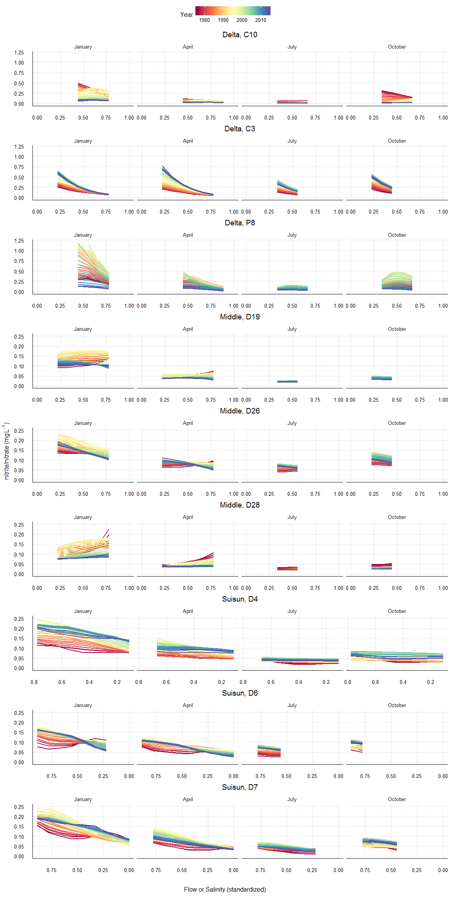

# README
Marcus W. Beck, beck.marcus@epa.gov  

### Files

**_data/_** Supporting RData files, usually from data in ignore folder, unless otherwise noted all files were created in `R/dat_proc.R`

* `bests.RData` subset of `flocor.RData` for min or max cor of each nut parm with flow or sal time series, respectively.  Each site is matched with the flow or salinity record ided in figure 10 of Novick et al

* `delt_dat.RData` Processed wq time series data `dwr_wq.RData`, includes all nitrogen analytes and current/active stations in the delta, also includes matched and smoothed flow records from `flocor.RData` results

* `dwr_wq.RData` time series data of stations in the SF delta from California DWR-EMP (Department of Water Resources, Environmental Monitoring Program) , processed by E. Novick, all stations, analytes from 1975 to present.  Most analytes are measured as concentration, see original spreadsheet for values.  Unavailable in GitHub repo.

* `flocor.RData` results of ccf analysis of selected delta and suisun stations comparing nitrogen and flow

* `flow_dat.RData` time series of daily flow estimates for the delta, input stations from Novick et al (Fig 2) were used

* `nutcor.RData` results of ccf analysis of selected delta and suisun stations comparing nitrogen species

* `mods.RData` dataset for wrtds, including model results. This is a nested data frame with identifiers.  All response, flow values are ln + 1 transformed, flow (or salinity) records for each nutrient variable and station are combined based on the monthly lag ided from `bests.RData`

**_R/_** Supporting R scripts

**_text/_** Summary text of analyses

### Comparing time series of nutrients and flow for selected stations

Monthly nutrient samples at selected stations were compared with flow estimates to characterize variation in time series correlations. Time series were compared using cross-correlation analysis with lags +/- 12 months.  Selected stations from the delta were C10, C3, and P8 and selected stations from Suisun were D4, D6, and D7.  Flow estimates from Novick et al. were the Sacramento River plus Yolo bypass (`sacyolo = sac + yolo`),  San Joaquin River (`sjr`).  Nutrient data were also compared with salinity observations at each station.  Nitrogen species evaluated included dissolved inorganic nitrogen (`din`), ammonium (`nh`), and nitrite/nitrate (`no23`). 

  
The above analysis was repeated to compare temporal variation of nitrogen species.  

### Matching stations to flow or salinity records

This table shows the preceding lag in months at which the correlation of the flow variable was highest (as an absolute magnitude) for the corresponding site and nutrient variable.  Flow variables matched with each nutrient station were those with the nearest geographic location, e.g., C10 is near the inflow of San Joaquin into the delta, D4 is closer to the ocean and was matched wtih salinity, etc.  Nutrient data were matched with the flow/salinity time series at the corresponding lag to develop weighted regression models.  For example, a maximum lag of -4 means that the flow record four months prior to the nutrient record was matched on the observed date of the nutrient sample. 

|Site_Code |Location |resvar |flovar      | lag|        acf|
|:---------|:--------|:------|:-----------|---:|----------:|
|C10       |Delta    |din    |San Joaquin |   0| -0.6269706|
|C10       |Delta    |nh     |San Joaquin |  -4| -0.2451807|
|C10       |Delta    |no23   |San Joaquin |   0| -0.6472901|
|C3        |Delta    |din    |Sacramento  |   0| -0.5077493|
|C3        |Delta    |nh     |Sacramento  |   0| -0.6839323|
|C3        |Delta    |no23   |Sacramento  |  -3| -0.2711726|
|P8        |Delta    |din    |San Joaquin |   0| -0.4151813|
|P8        |Delta    |nh     |San Joaquin |  -3| -0.1764686|
|P8        |Delta    |no23   |San Joaquin |   0| -0.4724534|
|D4        |Suisun   |din    |Salinity    |  -2|  0.5440757|
|D4        |Suisun   |nh     |Salinity    |  -2|  0.4444447|
|D4        |Suisun   |no23   |Salinity    |  -2|  0.5116835|
|D6        |Suisun   |din    |Salinity    |  -2|  0.4363288|
|D6        |Suisun   |nh     |Salinity    |  -1|  0.4233493|
|D6        |Suisun   |no23   |Salinity    |  -2|  0.3697885|
|D7        |Suisun   |din    |Salinity    |  -3|  0.5189457|
|D7        |Suisun   |nh     |Salinity    |  -2|  0.4753318|
|D7        |Suisun   |no23   |Salinity    |  -3|  0.4664261|

The plots below show annually-averaged results of weighted regression for each station using the nutrient records and matched flow/salinity data.  The three lines in each plot represent model results for the conditional distributions of the 10th, 50th, and 90th percentiles of the nutrient record.  Points represent model predictions and lines are flow-normalized predictions that show trends independent of flow variation.The following describes points of interest that can be idenfied from the plots:

* General trends - flow-normalized trends over time are the most descriptive of changes, are nutrients decreasing, inreasing, or constant?
* Differences in the percentiles - variation in the 10th or 90th percentile distributions that differ from the median response suggest changes in frequency occurrence of low or high nutrient events, respectively.  In other words, the median response does not tell the whole picture about change in nutrient concentrations over time.  
* Differences in flow-normalized predictions and observed predictions - large differences between the two represent either a large effect of flow or an inappropriate flow variable
* Differences in the magnitude of the modelled response between locations - differences can show the relative proportions of nitrogen species at each site.  This is why the y-axis limits are constant for each response measure.
* Differences by nutrient species - how do the plots change with the nutrient species given any of the above information?  

The plots below show changes over time in the relationship between nutrients and flow.  The plots are also separated by month because changes are expected to vary by season. In general, flow increases (or salinity decreases) are related to decreases in nutrient concentrations as more freshwater inputs have a dilution effect. The data in each plot are from the interpolation grid for weighted regression that is created during model fitting.  The data are model predicions from the fit at each unique point in the time series.  The flow values that are observed in each month across all years are used for model fitting and prediction.  The following information can be obtained from each plot:

* General response of nutrients to flow - a negative relationship is of course common.
* Changes in the response over time - does the relationship vary from early to later in the time series?  These changes might suggest system response to different sources of pollution.  Previous studies (Hirsch et al. 2010, Beck and Hagy 2015) suggested that changes in this response might indicate shifts between point and non-point sources of pollution.  That is, nutrients will show minimal response to changes in flow (flat lines) if point-sources dominate load inputs because they will not vary with flow.  Conversely, non-point sources of pollution will change with flow such that a negative response of nutrient concention to increasing flow may suggest a larger influence of non-point sources. 
* Changes in the concentration over time independent of the flow response - are the response lines higher or lower from early to later in the time series?  This can indicate a change in the average concentration, which should also be verified with the plots above.
* Changes by season - from top to bottom (variation by rows), how does the nutrient-flow relatinship vary throughout the year?  How does the nutrient-flow relatonship vary by season and throughout the time series (i.e., season/year interaction)?  Seasonal changes may be expected given climate patterns and flow inputs throughout the year.  Seasonal changes may also occur based on the succession of phytoplankton species throughout the year and the affinity for different nutrients. 
* Changes between sites - how does the flow/nutrient response vary by location (variation between columns)?  This could differ for a number of reasons. 
* Changes by nutrient species - how do the plots change with the nutrient species given any of the above information?  

The plots below show seasonal changes in flow-normalized results over time using a common-axis that shows only day of the year.  They are similar to the above plots except changes in response to flow are not explicitly included. As above, the lines are specific to different years in the time series.  Excluding specific information about flow response, most of the points for the above plots apply to those below.  The plots can be used as follows:

* Changes by season - from left to right, how do nutrients change throughout the year? 
* Changes by year - variation by color, do average nutrient concentrations change throughout the time series?
* Changes by year and season - is there an interaction between the two?  That is, does the seasonal change from left the right vary given the year?  
* Differences by location - how do the plots change with the site given any of the above information?  
* Differences by nutrient species - how do the plots change with the nutrient species given any of the above information?  

### Effect of using lagged flow or salinity variables

The effect of using lagged or no lagged flow or salinity variables on model performance was evaluated with residual errors.  Models were fit using the 'optimal' lags from above and using no lags.  The plot below shows root mean squared error for the different models fit, using the conditional median as an example. The identified lag for each station, variable combination is below each bar. Using lagged variables causes an increase in error and reduction in performance. 

### To do 

* get detection limits

