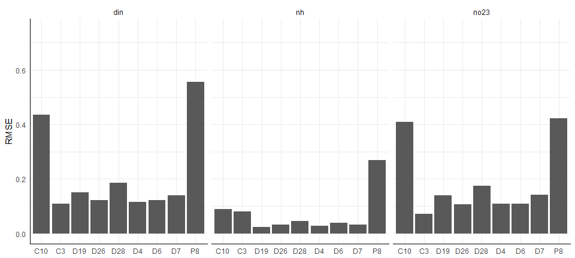

# README
Marcus W. Beck, beck.marcus@epa.gov  

### Files

**_data/_** Supporting RData files, usually from data in ignore folder 

* `delt_dat.RData` Processed wq time series data `dwr_wq.RData`, includes all nitrogen analytes and current/active stations in the delta, also includes matched and smoothed flow records from `flocor.RData` results, processed in `dat_proc.R`

* `dwr_wq.RData` time series data of stations in the SF delta from California DWR-EMP (Department of Water Resources, Environmental Monitoring Program) , processed by E. Novick, all stations, analytes from 1975 to present.  Most analytes are measured as concentration, see original spreadsheet for values. 

* `flocor.RData` data.frame of each wq station in `delt_dat.RData` compared with each flow time series in `flow_dat.RData`, lags and correlations for each are shown starting with zero lag back to the previous twelve months, only negative lags are evaluated, i.e, how far back (in months) are the flow time series correlated with nuts, created in `dat_proc.R`

* `flow_dat.RData` time series of daily flow estimates for the delta, input stations from Novick et al (Fig 2) were used, created in `dat_proc.R` 

* `res.RData` sample results for the delta

**_R/_** Supporting R scripts

**_text/_** Summary text of analyses

### Matching flow data with nutrient time series

Monthly nutrient samples at each of the active stations in the Delta were compared with daily flow data to identify the most relevant flow estimates for modelling.  Time series were compared using cross-correlation analysis to identify the minimum negative correlation between flow and nutrient concentration and the corresponding lag at which the minimum correlation was observed.  The time series comparisons were based on observed nitrite/nitrate and seasonal means of flow (monthly means of daily records by year).  Flow estimates in Novick et al. were used: Sacramento River plus Yolo bypass (`sacyolo = sac + yolo`), eastern tributaries (`east = csmr + moke + misc`), and San Joaquin River (`sjr`). 

 

|site |flo     |lag |        acf|
|:----|:-------|:---|----------:|
|D6   |sacyolo |-3  | -0.4314903|
|D19  |east    |-5  | -0.4489456|
|D4   |east    |-3  | -0.4992088|
|D8   |east    |-4  | -0.4903015|
|C10  |east    |-1  | -0.5927893|
|MD10 |east    |-4  | -0.3438148|
|C3   |east    |-4  | -0.3121967|
|D28A |east    |-5  | -0.3819177|
|D26  |sjr     |-5  | -0.4379171|
|D7   |sjr     |-4  | -0.4920025|
|P8   |sjr     |-1  | -0.4572284|

The flow record that had the minimum correlation with each nutrient station was then smoothed using a left-centered moving window average that had a window equal in length to the corresponding lag in the above table.  The smoothed flow records were then matched with the monthly nutrient records for the corresponding station.  

 

