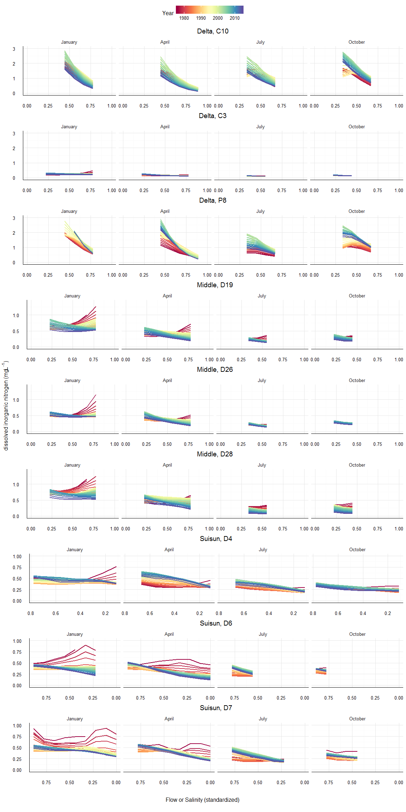
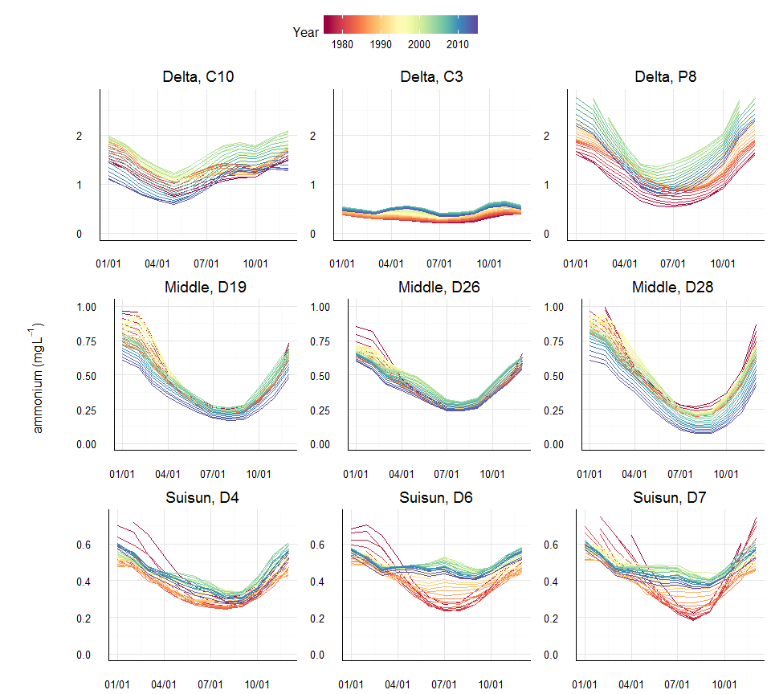
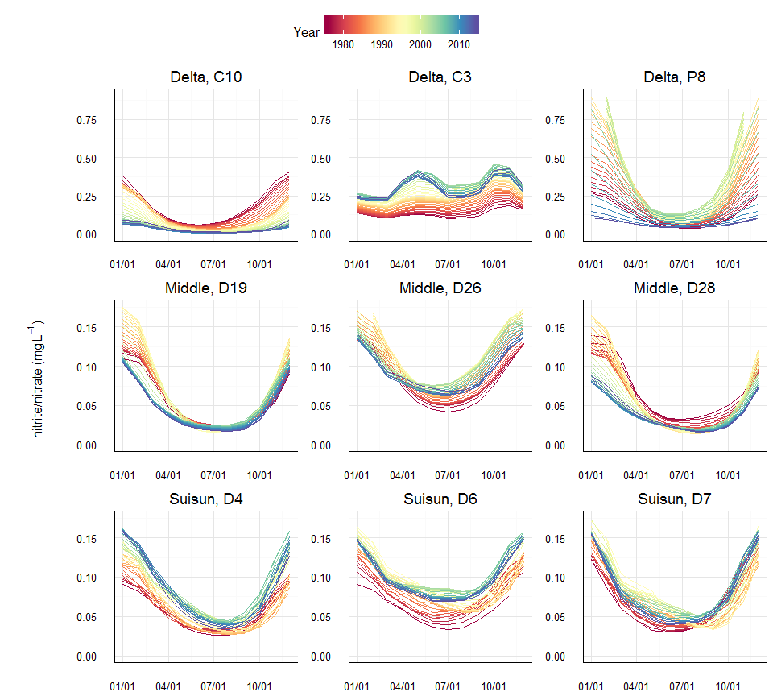
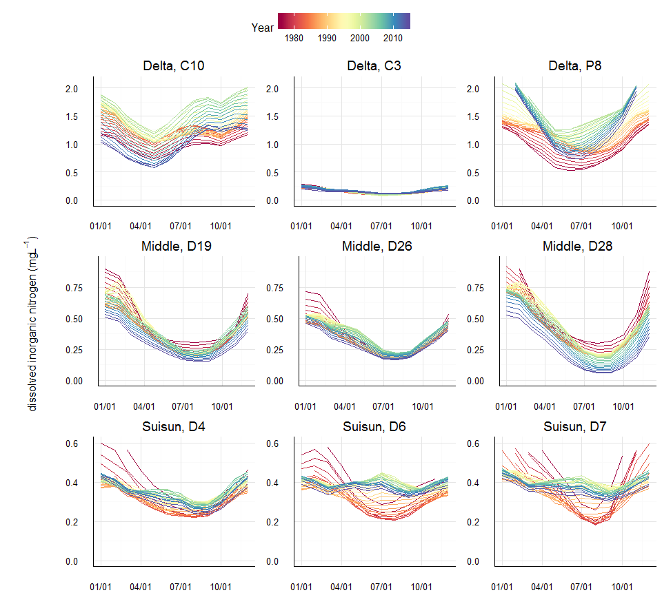
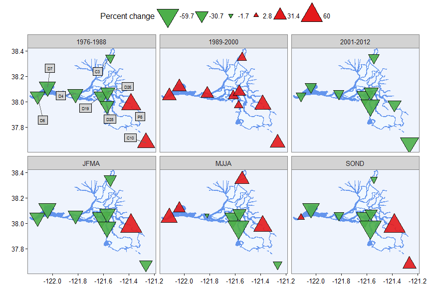

# README
Marcus W. Beck, beck.marcus@epa.gov  

Content available at [https://github.com/fawda123/sf_trends](https://github.com/fawda123/sf_trends)

### Files

**_data/_** Supporting RData files, usually from data in ignore folder, unless otherwise noted all files were created in `R/dat_proc.R`

* `clams.RData` clam data for D7 from Crauder 2016, includes sample date, water year (`yr` starting in October), biomass in g/m2, clams per sample (`clams_smp`) in no/m2, depth (m), growth rate (`gr`) in m3/m2/d, mean size (mm), number of grabs (`no_grabs`), recruitment per unit area (`recruit_area`) in recruit/0.05 m2, and species as corbicula or potamocorbula.

* `delt_dat.RData` Processed wq time series data `dwr_wq.RData`, includes all nitrogen analytes and current/active stations in the delta, also includes matched and smoothed flow records from `flocor.RData` results

* `delt_map.RData` SpatialPolygonsDataFrame object of approximate map of Delta region

* `ignore/dwr_wq.RData` time series data of stations in the SF delta from California DWR-EMP (Department of Water Resources, Environmental Monitoring Program) , processed by E. Novick, all stations, analytes from 1975 to present.  Most analytes are measured as concentration, see original spreadsheet for values.  Unavailable in GitHub repo.

* `flow_dat.RData` time series of daily flow estimates for the delta (m3/s), input stations from Novick et al (Fig 2) were used

* `h1dat.RData` mean models to support first hypothesis/case study in manuscript, wrtds mean models for din, no23, nh at C10

* `h2dat.RData` mean models to support second hypothesis/case study in manuscript, wrtds mean models for no23, nh at p8

* `h3dat.RData` mean models to support third hypothesis/case study in manuscript, wrtds mean models for sio2, din, chla at c10, d7

* `mods.RData` dataset for wrtds, including model results. This is a nested data frame with identifiers, nitrogen only.

* `sf_bay.RData` SpatialPolygonsDataFrame object of all of SF Bay

* `stock_conc.RData` summarized effluent data from Stockton wwtp, mg/L

* `stock_load.RData` nutrient load data from Stockton, kg/day

* `trnds_ave.RData` trend summary of averages by annual, monthly categories

* `trnds_chg.RData` trend summary of percent changes by annual, monthly categories

* `trnds_sk.RData` trend summary using seasonal kendall on flow-normalized results

* `trnds_seasyr.RData` sk trends on predicted and flow-norm WRTDS results, seasonal aggs by year

**_R/_** Supporting R scripts

**_text/_** Summary text of analyses


```r
library(ggplot2)
library(dplyr)
library(tidyr)
library(gridExtra)
library(lubridate)
library(purrr)
library(GGally)
library(ggrepel)
library(scales)
library(RColorBrewer)
library(WRTDStidal)
library(plotly)
source('R/funcs.R')
```

### Model performance {.tabset}

#### RMSE

```r
# load the data
data(mods)

ylims <- c(0, 0.75)
ytext <- -0.04

## get model performance from the data objects

# perfs
perfs <- mutate(mods,
    rmse = map(data, function(x) wrtdsperf(x, logspace = F)[, 1]),
    nmse = map(data, function(x) wrtdsperf(x, logspace = F)[, 2])
  ) %>% 
  select(-data) %>% 
  unnest

# the plot
p <- ggplot(perfs, aes(x = Site_Code, y = rmse)) +
  geom_bar(stat = 'identity') + 
  facet_grid(~resvar) +
  theme_minimal() +
  theme(
    axis.line.x = element_line(size = 0.5),
    axis.line.y = element_line(size = 0.5),
    legend.position = 'top',
    legend.title = element_blank(), 
    axis.title.x= element_blank()
    ) + 
  scale_y_continuous('RMSE', limits = ylims)
ggplotly(p)
```

<!--html_preserve--><div id="htmlwidget-603103ee3695d240aa3d" style="width:960px;height:432px;" class="plotly html-widget"></div>
<script type="application/json" data-for="htmlwidget-603103ee3695d240aa3d">{"x":{"data":[{"x":[1,2,3,4,5,6,7,8,9],"y":[0.435603493140122,0.109090852692742,0.149805405455961,0.121559693786271,0.184571285021817,0.116028899071185,0.122137079964991,0.140085933670441,0.555023614905033],"text":["Site_Code: C10<br>rmse: 0.44","Site_Code: C3<br>rmse: 0.11","Site_Code: D19<br>rmse: 0.15","Site_Code: D26<br>rmse: 0.12","Site_Code: D28<br>rmse: 0.18","Site_Code: D4<br>rmse: 0.12","Site_Code: D6<br>rmse: 0.12","Site_Code: D7<br>rmse: 0.14","Site_Code: P8<br>rmse: 0.56"],"key":null,"type":"bar","marker":{"autocolorscale":false,"color":"rgba(89,89,89,1)","line":{"width":1.88976377952756,"color":"transparent"}},"showlegend":false,"xaxis":"x","yaxis":"y","hoverinfo":"text","name":""},{"x":[1,2,3,4,5,6,7,8,9],"y":[0.0890589569192503,0.0790669187663152,0.0227660339430104,0.0308862359221857,0.0441078714631324,0.0270353075141909,0.0385816533104787,0.0326823928297945,0.26939497575263],"text":["Site_Code: C10<br>rmse: 0.09","Site_Code: C3<br>rmse: 0.08","Site_Code: D19<br>rmse: 0.02","Site_Code: D26<br>rmse: 0.03","Site_Code: D28<br>rmse: 0.04","Site_Code: D4<br>rmse: 0.03","Site_Code: D6<br>rmse: 0.04","Site_Code: D7<br>rmse: 0.03","Site_Code: P8<br>rmse: 0.27"],"key":null,"type":"bar","marker":{"autocolorscale":false,"color":"rgba(89,89,89,1)","line":{"width":1.88976377952756,"color":"transparent"}},"showlegend":false,"xaxis":"x2","yaxis":"y","hoverinfo":"text","name":""},{"x":[1,2,3,4,5,6,7,8,9],"y":[0.408687791944914,0.0704977971780044,0.139419095233687,0.106877496844753,0.173365236193644,0.10792337279109,0.107590751341712,0.141746189191742,0.422696270742756],"text":["Site_Code: C10<br>rmse: 0.41","Site_Code: C3<br>rmse: 0.07","Site_Code: D19<br>rmse: 0.14","Site_Code: D26<br>rmse: 0.11","Site_Code: D28<br>rmse: 0.17","Site_Code: D4<br>rmse: 0.11","Site_Code: D6<br>rmse: 0.11","Site_Code: D7<br>rmse: 0.14","Site_Code: P8<br>rmse: 0.42"],"key":null,"type":"bar","marker":{"autocolorscale":false,"color":"rgba(89,89,89,1)","line":{"width":1.88976377952756,"color":"transparent"}},"showlegend":false,"xaxis":"x3","yaxis":"y","hoverinfo":"text","name":""}],"layout":{"margin":{"t":43.9249112125824,"r":18.9954337899543,"b":31.5778792491121,"l":43.1050228310502},"font":{"color":"rgba(0,0,0,1)","family":"","size":14.6118721461187},"xaxis":{"domain":[0,0.327625570776256],"type":"linear","autorange":false,"tickmode":"array","range":[0.4,9.6],"ticktext":["C10","C3","D19","D26","D28","D4","D6","D7","P8"],"tickvals":[1,2,3,4,5,6,7,8,9],"ticks":"","tickcolor":null,"ticklen":3.65296803652968,"tickwidth":0,"showticklabels":true,"tickfont":{"color":"rgba(77,77,77,1)","family":"","size":11.689497716895},"tickangle":-0,"showline":true,"linecolor":null,"linewidth":0.66417600664176,"showgrid":true,"gridcolor":"rgba(235,235,235,1)","gridwidth":0.66417600664176,"zeroline":false,"anchor":"y","title":"","titlefont":{"color":null,"family":null,"size":0},"hoverformat":".2f"},"yaxis":{"domain":[0,1],"type":"linear","autorange":false,"tickmode":"array","range":[-0.0375,0.7875],"ticktext":["0.0","0.2","0.4","0.6"],"tickvals":[0,0.2,0.4,0.6],"ticks":"","tickcolor":null,"ticklen":3.65296803652968,"tickwidth":0,"showticklabels":true,"tickfont":{"color":"rgba(77,77,77,1)","family":"","size":11.689497716895},"tickangle":-0,"showline":true,"linecolor":null,"linewidth":0.66417600664176,"showgrid":true,"gridcolor":"rgba(235,235,235,1)","gridwidth":0.66417600664176,"zeroline":false,"anchor":"x","title":"","titlefont":{"color":"rgba(0,0,0,1)","family":"","size":14.6118721461187},"hoverformat":".2f"},"annotations":[{"text":"RMSE","x":-0.0222602739726027,"y":0.5,"showarrow":false,"ax":0,"ay":0,"font":{"color":"rgba(0,0,0,1)","family":"","size":14.6118721461187},"xref":"paper","yref":"paper","textangle":-90,"xanchor":"right","yanchor":"center","annotationType":"axis"},{"text":"din","x":0.163812785388128,"y":1,"showarrow":false,"ax":0,"ay":0,"font":{"color":"rgba(26,26,26,1)","family":"","size":11.689497716895},"xref":"paper","yref":"paper","textangle":-0,"xanchor":"center","yanchor":"bottom"},{"text":"nh","x":0.5,"y":1,"showarrow":false,"ax":0,"ay":0,"font":{"color":"rgba(26,26,26,1)","family":"","size":11.689497716895},"xref":"paper","yref":"paper","textangle":-0,"xanchor":"center","yanchor":"bottom"},{"text":"no23","x":0.836187214611872,"y":1,"showarrow":false,"ax":0,"ay":0,"font":{"color":"rgba(26,26,26,1)","family":"","size":11.689497716895},"xref":"paper","yref":"paper","textangle":-0,"xanchor":"center","yanchor":"bottom"}],"shapes":[{"type":"rect","fillcolor":null,"line":{"color":null,"width":0,"linetype":[]},"yref":"paper","xref":"paper","x0":0,"x1":0.327625570776256,"y0":0,"y1":1},{"type":"rect","fillcolor":null,"line":{"color":null,"width":0,"linetype":[]},"yref":"paper","xref":"paper","x0":0,"x1":0.327625570776256,"y0":1,"y1":1.05774278215223},{"type":"rect","fillcolor":null,"line":{"color":null,"width":0,"linetype":[]},"yref":"paper","xref":"paper","x0":0.339041095890411,"x1":0.660958904109589,"y0":0,"y1":1},{"type":"rect","fillcolor":null,"line":{"color":null,"width":0,"linetype":[]},"yref":"paper","xref":"paper","x0":0.339041095890411,"x1":0.660958904109589,"y0":1,"y1":1.05774278215223},{"type":"rect","fillcolor":null,"line":{"color":null,"width":0,"linetype":[]},"yref":"paper","xref":"paper","x0":0.672374429223744,"x1":1,"y0":0,"y1":1},{"type":"rect","fillcolor":null,"line":{"color":null,"width":0,"linetype":[]},"yref":"paper","xref":"paper","x0":0.672374429223744,"x1":1,"y0":1,"y1":1.05774278215223}],"xaxis2":{"type":"linear","autorange":false,"tickmode":"array","range":[0.4,9.6],"ticktext":["C10","C3","D19","D26","D28","D4","D6","D7","P8"],"tickvals":[1,2,3,4,5,6,7,8,9],"ticks":"","tickcolor":null,"ticklen":3.65296803652968,"tickwidth":0,"showticklabels":true,"tickfont":{"color":"rgba(77,77,77,1)","family":"","size":11.689497716895},"tickangle":-0,"showline":true,"linecolor":null,"linewidth":0.66417600664176,"showgrid":true,"domain":[0.339041095890411,0.660958904109589],"gridcolor":"rgba(235,235,235,1)","gridwidth":0.66417600664176,"zeroline":false,"anchor":"y","title":"","titlefont":{"color":null,"family":null,"size":0},"hoverformat":".2f"},"xaxis3":{"type":"linear","autorange":false,"tickmode":"array","range":[0.4,9.6],"ticktext":["C10","C3","D19","D26","D28","D4","D6","D7","P8"],"tickvals":[1,2,3,4,5,6,7,8,9],"ticks":"","tickcolor":null,"ticklen":3.65296803652968,"tickwidth":0,"showticklabels":true,"tickfont":{"color":"rgba(77,77,77,1)","family":"","size":11.689497716895},"tickangle":-0,"showline":true,"linecolor":null,"linewidth":0.66417600664176,"showgrid":true,"domain":[0.672374429223744,1],"gridcolor":"rgba(235,235,235,1)","gridwidth":0.66417600664176,"zeroline":false,"anchor":"y","title":"","titlefont":{"color":null,"family":null,"size":0},"hoverformat":".2f"},"showlegend":false,"legend":{"bgcolor":null,"bordercolor":null,"borderwidth":0,"font":{"color":"rgba(0,0,0,1)","family":"","size":11.689497716895}},"barmode":"stack","hovermode":"closest"},"source":"A","config":{"modeBarButtonsToAdd":[{"name":"Collaborate","icon":{"width":1000,"ascent":500,"descent":-50,"path":"M487 375c7-10 9-23 5-36l-79-259c-3-12-11-23-22-31-11-8-22-12-35-12l-263 0c-15 0-29 5-43 15-13 10-23 23-28 37-5 13-5 25-1 37 0 0 0 3 1 7 1 5 1 8 1 11 0 2 0 4-1 6 0 3-1 5-1 6 1 2 2 4 3 6 1 2 2 4 4 6 2 3 4 5 5 7 5 7 9 16 13 26 4 10 7 19 9 26 0 2 0 5 0 9-1 4-1 6 0 8 0 2 2 5 4 8 3 3 5 5 5 7 4 6 8 15 12 26 4 11 7 19 7 26 1 1 0 4 0 9-1 4-1 7 0 8 1 2 3 5 6 8 4 4 6 6 6 7 4 5 8 13 13 24 4 11 7 20 7 28 1 1 0 4 0 7-1 3-1 6-1 7 0 2 1 4 3 6 1 1 3 4 5 6 2 3 3 5 5 6 1 2 3 5 4 9 2 3 3 7 5 10 1 3 2 6 4 10 2 4 4 7 6 9 2 3 4 5 7 7 3 2 7 3 11 3 3 0 8 0 13-1l0-1c7 2 12 2 14 2l218 0c14 0 25-5 32-16 8-10 10-23 6-37l-79-259c-7-22-13-37-20-43-7-7-19-10-37-10l-248 0c-5 0-9-2-11-5-2-3-2-7 0-12 4-13 18-20 41-20l264 0c5 0 10 2 16 5 5 3 8 6 10 11l85 282c2 5 2 10 2 17 7-3 13-7 17-13z m-304 0c-1-3-1-5 0-7 1-1 3-2 6-2l174 0c2 0 4 1 7 2 2 2 4 4 5 7l6 18c0 3 0 5-1 7-1 1-3 2-6 2l-173 0c-3 0-5-1-8-2-2-2-4-4-4-7z m-24-73c-1-3-1-5 0-7 2-2 3-2 6-2l174 0c2 0 5 0 7 2 3 2 4 4 5 7l6 18c1 2 0 5-1 6-1 2-3 3-5 3l-174 0c-3 0-5-1-7-3-3-1-4-4-5-6z"},"click":"function(gd) { \n        // is this being viewed in RStudio?\n        if (location.search == '?viewer_pane=1') {\n          alert('To learn about plotly for collaboration, visit:\\n https://cpsievert.github.io/plotly_book/plot-ly-for-collaboration.html');\n        } else {\n          window.open('https://cpsievert.github.io/plotly_book/plot-ly-for-collaboration.html', '_blank');\n        }\n      }"}],"modeBarButtonsToRemove":["sendDataToCloud"]},"base_url":"https://plot.ly"},"evals":["config.modeBarButtonsToAdd.0.click"],"jsHooks":[]}</script><!--/html_preserve-->

#### NMSE

```r
# the plot
p <- ggplot(perfs, aes(x = Site_Code, y = nmse)) +
  geom_bar(stat = 'identity') + 
  facet_grid(~resvar) +
  theme_minimal() +
  theme(
    axis.line.x = element_line(size = 0.5),
    axis.line.y = element_line(size = 0.5),
    legend.position = 'top',
    legend.title = element_blank(), 
    axis.title.x= element_blank()
    ) + 
  scale_y_continuous('NMSE', limits = ylims)
ggplotly(p)
```

<!--html_preserve--><div id="htmlwidget-d84a37952b87446b03ce" style="width:960px;height:432px;" class="plotly html-widget"></div>
<script type="application/json" data-for="htmlwidget-d84a37952b87446b03ce">{"x":{"data":[{"x":[1,2,3,4,5,6,7,8,9],"y":[0.378964197096302,0.376955229756329,0.341272942683931,0.363743316903952,0.366976558509892,0.423719805921956,0.537918783308359,0.476378260528954,0.329255125548206],"text":["Site_Code: C10<br>nmse: 0.38","Site_Code: C3<br>nmse: 0.38","Site_Code: D19<br>nmse: 0.34","Site_Code: D26<br>nmse: 0.36","Site_Code: D28<br>nmse: 0.37","Site_Code: D4<br>nmse: 0.42","Site_Code: D6<br>nmse: 0.54","Site_Code: D7<br>nmse: 0.48","Site_Code: P8<br>nmse: 0.33"],"key":null,"type":"bar","marker":{"autocolorscale":false,"color":"rgba(89,89,89,1)","line":{"width":1.88976377952756,"color":"transparent"}},"showlegend":false,"xaxis":"x","yaxis":"y","hoverinfo":"text","name":""},{"x":[1,2,3,4,5,6,7,8,9],"y":[0.472727468928305,0.312156740933169,0.261176189174394,0.415747127682338,0.538708294087038,0.298663294662063,0.555607865579871,0.385481482577808,0.488449714648173],"text":["Site_Code: C10<br>nmse: 0.47","Site_Code: C3<br>nmse: 0.31","Site_Code: D19<br>nmse: 0.26","Site_Code: D26<br>nmse: 0.42","Site_Code: D28<br>nmse: 0.54","Site_Code: D4<br>nmse: 0.3","Site_Code: D6<br>nmse: 0.56","Site_Code: D7<br>nmse: 0.39","Site_Code: P8<br>nmse: 0.49"],"key":null,"type":"bar","marker":{"autocolorscale":false,"color":"rgba(89,89,89,1)","line":{"width":1.88976377952756,"color":"transparent"}},"showlegend":false,"xaxis":"x2","yaxis":"y","hoverinfo":"text","name":""},{"x":[1,2,3,4,5,6,7,8,9],"y":[0.382582682670513,0.542517317666484,0.393802597925836,0.387458338549059,0.419333420663954,0.504931285510714,0.578841398741026,0.656971835380416,0.326859073496736],"text":["Site_Code: C10<br>nmse: 0.38","Site_Code: C3<br>nmse: 0.54","Site_Code: D19<br>nmse: 0.39","Site_Code: D26<br>nmse: 0.39","Site_Code: D28<br>nmse: 0.42","Site_Code: D4<br>nmse: 0.5","Site_Code: D6<br>nmse: 0.58","Site_Code: D7<br>nmse: 0.66","Site_Code: P8<br>nmse: 0.33"],"key":null,"type":"bar","marker":{"autocolorscale":false,"color":"rgba(89,89,89,1)","line":{"width":1.88976377952756,"color":"transparent"}},"showlegend":false,"xaxis":"x3","yaxis":"y","hoverinfo":"text","name":""}],"layout":{"margin":{"t":43.9249112125824,"r":18.9954337899543,"b":31.5778792491121,"l":43.1050228310502},"font":{"color":"rgba(0,0,0,1)","family":"","size":14.6118721461187},"xaxis":{"domain":[0,0.327625570776256],"type":"linear","autorange":false,"tickmode":"array","range":[0.4,9.6],"ticktext":["C10","C3","D19","D26","D28","D4","D6","D7","P8"],"tickvals":[1,2,3,4,5,6,7,8,9],"ticks":"","tickcolor":null,"ticklen":3.65296803652968,"tickwidth":0,"showticklabels":true,"tickfont":{"color":"rgba(77,77,77,1)","family":"","size":11.689497716895},"tickangle":-0,"showline":true,"linecolor":null,"linewidth":0.66417600664176,"showgrid":true,"gridcolor":"rgba(235,235,235,1)","gridwidth":0.66417600664176,"zeroline":false,"anchor":"y","title":"","titlefont":{"color":null,"family":null,"size":0},"hoverformat":".2f"},"yaxis":{"domain":[0,1],"type":"linear","autorange":false,"tickmode":"array","range":[-0.0375,0.7875],"ticktext":["0.0","0.2","0.4","0.6"],"tickvals":[0,0.2,0.4,0.6],"ticks":"","tickcolor":null,"ticklen":3.65296803652968,"tickwidth":0,"showticklabels":true,"tickfont":{"color":"rgba(77,77,77,1)","family":"","size":11.689497716895},"tickangle":-0,"showline":true,"linecolor":null,"linewidth":0.66417600664176,"showgrid":true,"gridcolor":"rgba(235,235,235,1)","gridwidth":0.66417600664176,"zeroline":false,"anchor":"x","title":"","titlefont":{"color":"rgba(0,0,0,1)","family":"","size":14.6118721461187},"hoverformat":".2f"},"annotations":[{"text":"NMSE","x":-0.0222602739726027,"y":0.5,"showarrow":false,"ax":0,"ay":0,"font":{"color":"rgba(0,0,0,1)","family":"","size":14.6118721461187},"xref":"paper","yref":"paper","textangle":-90,"xanchor":"right","yanchor":"center","annotationType":"axis"},{"text":"din","x":0.163812785388128,"y":1,"showarrow":false,"ax":0,"ay":0,"font":{"color":"rgba(26,26,26,1)","family":"","size":11.689497716895},"xref":"paper","yref":"paper","textangle":-0,"xanchor":"center","yanchor":"bottom"},{"text":"nh","x":0.5,"y":1,"showarrow":false,"ax":0,"ay":0,"font":{"color":"rgba(26,26,26,1)","family":"","size":11.689497716895},"xref":"paper","yref":"paper","textangle":-0,"xanchor":"center","yanchor":"bottom"},{"text":"no23","x":0.836187214611872,"y":1,"showarrow":false,"ax":0,"ay":0,"font":{"color":"rgba(26,26,26,1)","family":"","size":11.689497716895},"xref":"paper","yref":"paper","textangle":-0,"xanchor":"center","yanchor":"bottom"}],"shapes":[{"type":"rect","fillcolor":null,"line":{"color":null,"width":0,"linetype":[]},"yref":"paper","xref":"paper","x0":0,"x1":0.327625570776256,"y0":0,"y1":1},{"type":"rect","fillcolor":null,"line":{"color":null,"width":0,"linetype":[]},"yref":"paper","xref":"paper","x0":0,"x1":0.327625570776256,"y0":1,"y1":1.05774278215223},{"type":"rect","fillcolor":null,"line":{"color":null,"width":0,"linetype":[]},"yref":"paper","xref":"paper","x0":0.339041095890411,"x1":0.660958904109589,"y0":0,"y1":1},{"type":"rect","fillcolor":null,"line":{"color":null,"width":0,"linetype":[]},"yref":"paper","xref":"paper","x0":0.339041095890411,"x1":0.660958904109589,"y0":1,"y1":1.05774278215223},{"type":"rect","fillcolor":null,"line":{"color":null,"width":0,"linetype":[]},"yref":"paper","xref":"paper","x0":0.672374429223744,"x1":1,"y0":0,"y1":1},{"type":"rect","fillcolor":null,"line":{"color":null,"width":0,"linetype":[]},"yref":"paper","xref":"paper","x0":0.672374429223744,"x1":1,"y0":1,"y1":1.05774278215223}],"xaxis2":{"type":"linear","autorange":false,"tickmode":"array","range":[0.4,9.6],"ticktext":["C10","C3","D19","D26","D28","D4","D6","D7","P8"],"tickvals":[1,2,3,4,5,6,7,8,9],"ticks":"","tickcolor":null,"ticklen":3.65296803652968,"tickwidth":0,"showticklabels":true,"tickfont":{"color":"rgba(77,77,77,1)","family":"","size":11.689497716895},"tickangle":-0,"showline":true,"linecolor":null,"linewidth":0.66417600664176,"showgrid":true,"domain":[0.339041095890411,0.660958904109589],"gridcolor":"rgba(235,235,235,1)","gridwidth":0.66417600664176,"zeroline":false,"anchor":"y","title":"","titlefont":{"color":null,"family":null,"size":0},"hoverformat":".2f"},"xaxis3":{"type":"linear","autorange":false,"tickmode":"array","range":[0.4,9.6],"ticktext":["C10","C3","D19","D26","D28","D4","D6","D7","P8"],"tickvals":[1,2,3,4,5,6,7,8,9],"ticks":"","tickcolor":null,"ticklen":3.65296803652968,"tickwidth":0,"showticklabels":true,"tickfont":{"color":"rgba(77,77,77,1)","family":"","size":11.689497716895},"tickangle":-0,"showline":true,"linecolor":null,"linewidth":0.66417600664176,"showgrid":true,"domain":[0.672374429223744,1],"gridcolor":"rgba(235,235,235,1)","gridwidth":0.66417600664176,"zeroline":false,"anchor":"y","title":"","titlefont":{"color":null,"family":null,"size":0},"hoverformat":".2f"},"showlegend":false,"legend":{"bgcolor":null,"bordercolor":null,"borderwidth":0,"font":{"color":"rgba(0,0,0,1)","family":"","size":11.689497716895}},"barmode":"stack","hovermode":"closest"},"source":"A","config":{"modeBarButtonsToAdd":[{"name":"Collaborate","icon":{"width":1000,"ascent":500,"descent":-50,"path":"M487 375c7-10 9-23 5-36l-79-259c-3-12-11-23-22-31-11-8-22-12-35-12l-263 0c-15 0-29 5-43 15-13 10-23 23-28 37-5 13-5 25-1 37 0 0 0 3 1 7 1 5 1 8 1 11 0 2 0 4-1 6 0 3-1 5-1 6 1 2 2 4 3 6 1 2 2 4 4 6 2 3 4 5 5 7 5 7 9 16 13 26 4 10 7 19 9 26 0 2 0 5 0 9-1 4-1 6 0 8 0 2 2 5 4 8 3 3 5 5 5 7 4 6 8 15 12 26 4 11 7 19 7 26 1 1 0 4 0 9-1 4-1 7 0 8 1 2 3 5 6 8 4 4 6 6 6 7 4 5 8 13 13 24 4 11 7 20 7 28 1 1 0 4 0 7-1 3-1 6-1 7 0 2 1 4 3 6 1 1 3 4 5 6 2 3 3 5 5 6 1 2 3 5 4 9 2 3 3 7 5 10 1 3 2 6 4 10 2 4 4 7 6 9 2 3 4 5 7 7 3 2 7 3 11 3 3 0 8 0 13-1l0-1c7 2 12 2 14 2l218 0c14 0 25-5 32-16 8-10 10-23 6-37l-79-259c-7-22-13-37-20-43-7-7-19-10-37-10l-248 0c-5 0-9-2-11-5-2-3-2-7 0-12 4-13 18-20 41-20l264 0c5 0 10 2 16 5 5 3 8 6 10 11l85 282c2 5 2 10 2 17 7-3 13-7 17-13z m-304 0c-1-3-1-5 0-7 1-1 3-2 6-2l174 0c2 0 4 1 7 2 2 2 4 4 5 7l6 18c0 3 0 5-1 7-1 1-3 2-6 2l-173 0c-3 0-5-1-8-2-2-2-4-4-4-7z m-24-73c-1-3-1-5 0-7 2-2 3-2 6-2l174 0c2 0 5 0 7 2 3 2 4 4 5 7l6 18c1 2 0 5-1 6-1 2-3 3-5 3l-174 0c-3 0-5-1-7-3-3-1-4-4-5-6z"},"click":"function(gd) { \n        // is this being viewed in RStudio?\n        if (location.search == '?viewer_pane=1') {\n          alert('To learn about plotly for collaboration, visit:\\n https://cpsievert.github.io/plotly_book/plot-ly-for-collaboration.html');\n        } else {\n          window.open('https://cpsievert.github.io/plotly_book/plot-ly-for-collaboration.html', '_blank');\n        }\n      }"}],"modeBarButtonsToRemove":["sendDataToCloud"]},"base_url":"https://plot.ly"},"evals":["config.modeBarButtonsToAdd.0.click"],"jsHooks":[]}</script><!--/html_preserve-->

### Annually-averaged results {.tabset}

The plots below show annually-averaged results of weighted regression for each station using the combined nutrient records and flow/salinity data.  The three lines in each plot represent model results for the conditional distributions of the 10th, 50th, and 90th percentiles of the nutrient record.  Points represent model predictions and lines are flow-normalized predictions that show trends independent of flow variation.The following describes points of interest that can be idenfied from the plots:

* General trends - flow-normalized trends over time are the most descriptive of changes, are nutrients decreasing, inreasing, or constant?
* Differences in the percentiles - variation in the 10th or 90th percentile distributions that differ from the median response suggest changes in frequency occurrence of low or high nutrient events, respectively.  In other words, the median response does not tell the whole picture about change in nutrient concentrations over time.  
* Differences in flow-normalized predictions and observed predictions - large differences between the two represent either a large effect of flow or an inappropriate flow variable
* Differences in the magnitude of the modelled response between locations - differences can show the relative proportions of nitrogen species at each site.  This is why the y-axis limits are constant for each response measure.
* Differences by nutrient species - how do the plots change with the nutrient species given any of the above information?  

See [here](https://beckmw.shinyapps.io/sf_trends/) for an interactive application of model results. 

#### DIN

```r
data(mods)

# y axis limits
lims <- data.frame(Delta = c(3, 0.85, 2.6), Middle = c(0.9, 0.175, 0.8), Suisun = c(1, 0.2, 0.8))
row.names(lims) <- c('din', 'nh', 'no23')

for(i in 1:nrow(mods)){

  toplo <- mods$data[[i]]
  lab <- paste(mods[i, 'Location'], mods[i, 'Site_Code'], sep = ', ')
  
  # axis limits by resp var and location var
  resv <- as.character(mods[i, 'resvar'])
  locv <- as.character(mods[i, 'Location'])
  limy <- lims[resv, locv]
    
  p <- prdnrmplot(toplo, logspace = F, min_mo = 11) +
    ggtitle(lab) + 
    theme_minimal() +
    theme(
      axis.title = element_blank(), 
      legend.position = 'top', 
      axis.line.x = element_line(size = 0.5),
      axis.line.y = element_line(size = 0.5) 
    ) +
    scale_y_continuous(limits = c(0, limy))

  # get legend
  if(i == 1) pleg <- g_legend(p)
  p <- p + theme(legend.position = 'none')

  assign(paste0('p', i), p)

}

# # for ref
# din <- which(mods$resvar == 'din')
# nh <- which(mods$resvar == 'nh')
# no23 <- which(mods$resvar == 'no23')

ylab1 <- gsub('ln-', '', as.character(attr(mods$data[[1]], 'reslab')))
ylab1 <- parse(text = ylab1)
ylab2 <- gsub('ln-', '', as.character(attr(mods$data[[2]], 'reslab')))
ylab2 <- parse(text = ylab2)
ylab3 <- gsub('ln-', '', as.character(attr(mods$data[[3]], 'reslab')))
ylab3 <- parse(text = ylab3)

grid.arrange(
  pleg, nrow = 2, heights = c(0.1, 1), 
  arrangeGrob(
  ncol = 2, widths = c(0.1, 1), 
    grid::textGrob(ylab1, rot = 90), 
    arrangeGrob(p3, p6, p9, p12, p15, p18, p21, p24, p27, ncol = 3)
  )
)
```

<!-- -->

#### NH4

```r
grid.arrange(
  pleg, nrow = 2, heights = c(0.1, 1), 
  arrangeGrob(
  ncol = 2, widths = c(0.1, 1), 
    grid::textGrob(ylab2, rot = 90), 
    arrangeGrob(p1, p4, p7, p10, p13, p16, p19, p22, p25, ncol = 3)
  )
)
```

<!-- -->

#### NO23 

```r
grid.arrange(
  pleg, nrow = 2, heights = c(0.1, 1), 
  arrangeGrob(
  ncol = 2, widths = c(0.1, 1), 
    grid::textGrob(ylab3, rot = 90), 
    arrangeGrob(p2, p5, p8, p11, p14, p17, p20, p23, p26, ncol = 3)
  )
)
```

<!-- -->

### Flow by nutrients by time {.tabset}

The plots below show changes over time in the relationship between nutrients and flow.  The plots are also separated by month because changes are expected to vary by season. In general, flow increases (or salinity decreases) are related to decreases in nutrient concentrations as more freshwater inputs have a dilution effect. The data in each plot are from the interpolation grid for weighted regression that is created during model fitting.  The data are model predicions from the fit at each unique point in the time series.  The flow values that are observed in each month across all years are used for model fitting and prediction.  The following information can be obtained from each plot:

* General response of nutrients to flow - a negative relationship is of course common.
* Changes in the response over time - does the relationship vary from early to later in the time series?  These changes might suggest system response to different sources of pollution.  Previous studies (Hirsch et al. 2010, Beck and Hagy 2015) suggested that changes in this response might indicate shifts between point and non-point sources of pollution.  That is, nutrients will show minimal response to changes in flow (flat lines) if point-sources dominate load inputs because they will not vary with flow.  Conversely, non-point sources of pollution will change with flow such that a negative response of nutrient concention to increasing flow may suggest a larger influence of non-point sources. 
* Changes in the concentration over time independent of the flow response - are the response lines higher or lower from early to later in the time series?  This can indicate a change in the average concentration, which should also be verified with the plots above.
* Changes by season - from top to bottom (variation by rows), how does the nutrient-flow relatinship vary throughout the year?  How does the nutrient-flow relatonship vary by season and throughout the time series (i.e., season/year interaction)?  Seasonal changes may be expected given climate patterns and flow inputs throughout the year.  Seasonal changes may also occur based on the succession of phytoplankton species throughout the year and the affinity for different nutrients. 
* Changes between sites - how does the flow/nutrient response vary by location (variation between columns)?  This could differ for a number of reasons. 
* Changes by nutrient species - how do the plots change with the nutrient species given any of the above information?  

#### DIN

```r
data(mods)

# y axis limits
lims <- data.frame(Delta = c(3.2, 1.2, 3), Middle = c(1.5, 0.25, 1.4), Suisun = c(1, 0.25, 1))
row.names(lims) <- c('din', 'nh', 'no23')

for(i in 1:nrow(mods)){

  toplo <- mods$data[[i]]
  lab <- paste(mods[i, 'Location'], mods[i, 'Site_Code'], sep = ', ')
  
  # axis limits by resp var and location var
  resv <- as.character(mods[i, 'resvar'])
  locv <- as.character(mods[i, 'Location'])
  limy <- lims[resv, locv]
    
  p <- dynaplot(toplo, month = c(1, 4, 7, 10), ncol = 4, logspace = F) +
    ggtitle(lab) + 
    theme_minimal() +
    theme(
      axis.title = element_blank(), 
      legend.position = 'top', 
      axis.line.x = element_line(size = 0.5),
      axis.line.y = element_line(size = 0.5) 
      ) +
    scale_x_continuous(limits = c(0, 1)) +
    scale_y_continuous(limits = c(0, limy))

  # flip if Suisun (salinity was used)
  if(as.character(mods[i, 'Location']) == 'Suisun')
    p <- p + scale_x_reverse()
  
  # get legend
  if(i == 1) pleg <- g_legend(p)
  p <- p + theme(legend.position = 'none')

  assign(paste0('p', i), p)

}

# # for ref
# din <- which(mods$resvar == 'din')
# nh <- which(mods$resvar == 'nh')
# no23 <- which(mods$resvar == 'no23')

ylab1 <- gsub('ln-', '', as.character(attr(mods$data[[1]], 'reslab')))
ylab1 <- parse(text = ylab1)
ylab2 <- gsub('ln-', '', as.character(attr(mods$data[[2]], 'reslab')))
ylab2 <- parse(text = ylab2)
ylab3 <- gsub('ln-', '', as.character(attr(mods$data[[3]], 'reslab')))
ylab3 <- parse(text = ylab3)

grid.arrange(
  pleg, nrow = 3, heights = c(0.1, 3, 0.1), 
  arrangeGrob(
  ncol = 2, widths = c(0.025, 1), 
    grid::textGrob(ylab1, rot = 90), 
    arrangeGrob(p3, p6, p9, p12, p15, p18, p21, p24, p27, ncol = 1)
  ), 
  grid::textGrob('Flow or Salinity (standardized)')
)
```

<!-- -->

#### NH4

```r
grid.arrange(
  pleg, nrow = 3, heights = c(0.1, 3, 0.1), 
  arrangeGrob(
  ncol = 2, widths = c(0.025, 1), 
    grid::textGrob(ylab2, rot = 90), 
    arrangeGrob(p1, p4, p7, p10, p13, p16, p19, p22, p25, ncol = 1)
  ), 
  grid::textGrob('Flow or Salinity (standardized)')
)
```

<!-- -->

#### NO23

```r
grid.arrange(
  pleg, nrow = 3, heights = c(0.1, 3, 0.1), 
  arrangeGrob(
  ncol = 2, widths = c(0.025, 1), 
    grid::textGrob(ylab3, rot = 90), 
    arrangeGrob(p2, p5, p8, p11, p14, p17, p20, p23, p26, ncol = 1)
  ), 
  grid::textGrob('Flow or Salinity (standardized)')
)
```

<!-- -->

### Nutrients by season by year {.tabset}

The plots below show seasonal changes in flow-normalized results over time using a common-axis that shows only day of the year.  They are similar to the above plots except changes in response to flow are not explicitly included. As above, the lines are specific to different years in the time series.  Excluding specific information about flow response, most of the points for the above plots apply to those below.  The plots can be used as follows:

* Changes by season - from left to right, how do nutrients change throughout the year? 
* Changes by year - variation by color, do average nutrient concentrations change throughout the time series?
* Changes by year and season - is there an interaction between the two?  That is, does the seasonal change from left the right vary given the year?  
* Differences by location - how do the plots change with the site given any of the above information?  
* Differences by nutrient species - how do the plots change with the nutrient species given any of the above information?  

#### DIN

```r
data(mods)

# y axis limits for each plot
lims <- data.frame(
  var = c('din', 'nh', 'no23'),
  upy = c(2.8, 0.9, 2.1)
)

# y axis limits
lims <- data.frame(Delta = c(2.8, 0.9, 2.1), Middle = c(1, 0.175, 0.95), Suisun = c(0.75, 0.175, 0.6))
row.names(lims) <- c('din', 'nh', 'no23')

for(i in 1:nrow(mods)){

  toplo <- mods$data[[i]]
  lab <- paste(mods[i, 'Location'], mods[i, 'Site_Code'], sep = ', ')
  
  # axis limits by resp var and location var
  resv <- as.character(mods[i, 'resvar'])
  locv <- as.character(mods[i, 'Location'])
  limy <- lims[resv, locv]
    
  p <- seasyrplot(toplo, predicted = F, logspace = F) +
    ggtitle(lab) + 
    theme_minimal() +
    theme(
      axis.title = element_blank(), 
      legend.position = 'top',
      axis.line.x = element_line(size = 0.5),
      axis.line.y = element_line(size = 0.5) 
      ) +
    scale_y_continuous(limits = c(0, limy))

  # get legend
  if(i == 1) pleg <- g_legend(p)
  p <- p + theme(legend.position = 'none')

  assign(paste0('p', i), p)

}

ylab1 <- gsub('ln-', '', as.character(attr(mods$data[[1]], 'reslab')))
ylab1 <- parse(text = ylab1)
ylab2 <- gsub('ln-', '', as.character(attr(mods$data[[2]], 'reslab')))
ylab2 <- parse(text = ylab2)
ylab3 <- gsub('ln-', '', as.character(attr(mods$data[[3]], 'reslab')))
ylab3 <- parse(text = ylab3)

grid.arrange(
  pleg, nrow = 2, heights = c(0.1, 1), 
  arrangeGrob(
  ncol = 2, widths = c(0.1, 1), 
    grid::textGrob(ylab1, rot = 90), 
    arrangeGrob(p3, p6, p9, p12, p15, p18, p21, p24, p27, ncol = 3)
  )
)
```

<!-- -->

#### NH4

```r
grid.arrange(
  pleg, nrow = 2, heights = c(0.1, 1), 
  arrangeGrob(
  ncol = 2, widths = c(0.1, 1), 
    grid::textGrob(ylab2, rot = 90), 
    arrangeGrob(p1, p4, p7, p10, p13, p16, p19, p22, p25, ncol = 3)
  )
)
```

<!-- -->

#### NO23

```r
grid.arrange(
  pleg, nrow = 2, heights = c(0.1, 1), 
  arrangeGrob(
  ncol = 2, widths = c(0.1, 1), 
    grid::textGrob(ylab3, rot = 90), 
    arrangeGrob(p2, p5, p8, p11, p14, p17, p20, p23, p26, ncol = 3)
  )
)
```

<!-- -->

### Trend maps {.tabset}

Trends are reported as percent changes of annual averages from the beginning to the end of each period. For monthly trends, percent changes are based on an average of the first three and last three annual averages to reduce the effects of odd years at the beginning and end of each period. For example, percent changes for January throughout a time series from 1980 to 2000 would be the change of the average from January in 1980-1982 to the average from January in 1998-2000. Annual trends, e.g., percent changes from 1980-1986, 1987-1993, etc. do not average by the first and last three years in each grouping because the values are already based on annual averages.  All trends are based on back-transformed, flow-normalized results.

#### DIN


```r
trnd_map(res = 'din', mods = mods)
```

<!-- -->

#### NH4


```r
trnd_map(res = 'nh', mods = mods)
```

<!-- -->

#### NO23


```r
trnd_map(res = 'no23', mods = mods)
```

<!-- -->

### Comparison of trends and effects of flow {.tabset}

Seasonal Kendall tests were used to characterize trends using results from the WRTDS models. Trends were compared on the predicted and flow-normalized values to identify potential effects of flow.  Trends were evaluated for different annual groupings and seasonal groupings within each annual group.


```r
data(trnds_seasyr)

# combine all
trnds_seasyr <- rbind(trnds_nrm, trnds_fit, trnds_obs) %>% 
  select(Site_Code, resvar, cat, perchg, ann, trndvar) %>% 
  spread(trndvar, perchg) %>% 
  mutate(Site_Code = factor(Site_Code, levels = c('D7', 'D6', 'D4', 'D28', 'D26', 'D19', 'P8', 'C10', 'C3')))

# response labels 
reslabs <- list(
  shrt = c('din', 'nh', 'no23'),
  expr = c(
    'DIN', 
    expression(paste(NH [4] ^ '+')),
    expression(paste(NO [2] ^ '-', ' / ', NO [3] ^ '2-'))
  )
)

# year only
toplo1 <- filter(trnds_seasyr, cat %in% c('1976-1995', '1996-2014')) %>% 
  gather('var', 'val', fits:norm) %>% 
  mutate(
    resvar = factor(resvar, levels = reslabs$shrt, labels = reslabs$expr), 
    var = factor(var, levels = c('fits', 'norm'), labels = c('Predicted', 'Flow-normalized'))
  )

# seasonal, first years
toplo2 <- filter(trnds_seasyr, !cat %in% c('1976-1995', '1996-2014')& ann == 'bef') %>% 
  gather('var', 'val', fits:norm) %>% 
  mutate(
    resvar = factor(resvar, levels = reslabs$shrt, labels = reslabs$expr), 
    var = factor(var, levels = c('fits', 'norm'), labels = c('Predicted', 'Flow-normalized'))
  )

# seasonal, first years
toplo3 <- filter(trnds_seasyr, !cat %in% c('1976-1995', '1996-2014')& ann == 'aft') %>% 
  gather('var', 'val', fits:norm) %>% 
  mutate(
    resvar = factor(resvar, levels = reslabs$shrt, labels = reslabs$expr), 
    var = factor(var, levels = c('fits', 'norm'), labels = c('Predicted', 'Flow-normalized'))
  )

mythm <- theme_minimal() +
  theme(
    legend.position = 'top', 
    legend.title = element_blank(), 
    axis.title.y = element_blank(),
    panel.border = element_rect(colour = "black", fill = NA, size = 0.5),
    axis.ticks.x = element_line(),
    axis.ticks.y = element_line(),
    axis.ticks.length = unit(.1, "cm")
  )  
    
p1 <- ggplot(toplo1, aes(x = val, y = Site_Code)) + 
  geom_point(aes(pch = var), size = 3, alpha = 0.8) + 
  facet_grid(cat~resvar, labeller = label_parsed
    ) + 
  geom_vline(xintercept = 0, linetype = 'dashed') + 
  mythm + 
  xlab(expression('% chg yr' ^-1)) +
  scale_shape_manual(values = c(16, 1)) + 
  ggtitle('Annual groups')

p2 <- ggplot(toplo2, aes(x = val, y = Site_Code)) + 
  geom_point(aes(pch = var), size = 3, alpha = 0.8) + 
  facet_grid(cat~resvar, labeller = label_parsed
    ) + 
  geom_vline(xintercept = 0, linetype = 'dashed') + 
  mythm + 
  xlab(expression('% chg yr' ^-1)) +
  scale_shape_manual(values = c(16, 1)) + 
  ggtitle('Seasonal groups, 1976-1995')

p3 <- ggplot(toplo3, aes(x = val, y = Site_Code)) + 
  geom_point(aes(pch = var), size = 3, alpha = 0.8) + 
  facet_grid(cat~resvar, labeller = label_parsed
    ) + 
  geom_vline(xintercept = 0, linetype = 'dashed') + 
  mythm + 
  xlab(expression('% chg yr' ^-1)) +
  scale_shape_manual(values = c(16, 1)) + 
  ggtitle('Seasonal groups, 1996-2014')
```

#### Annual groups


```r
p1
```

<!-- -->

#### Seasonal groups, 1976-1995


```r
p2
```

<!-- -->

#### Seasonal groups, 1996-2014


```r
p3
```

<!-- -->

