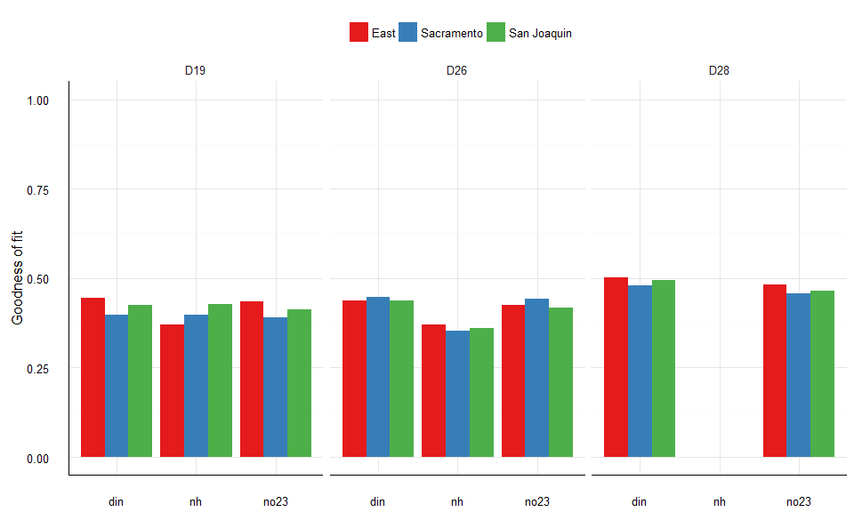
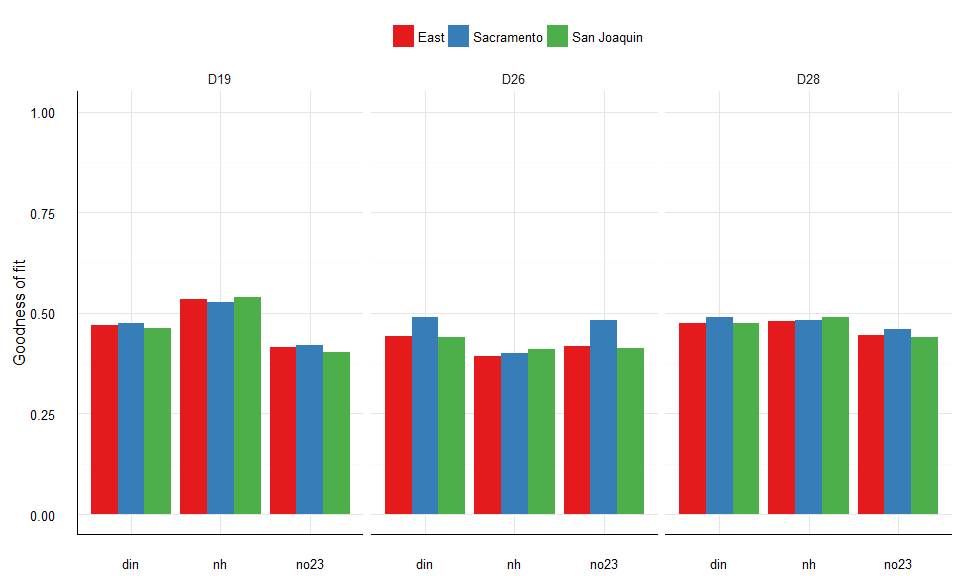
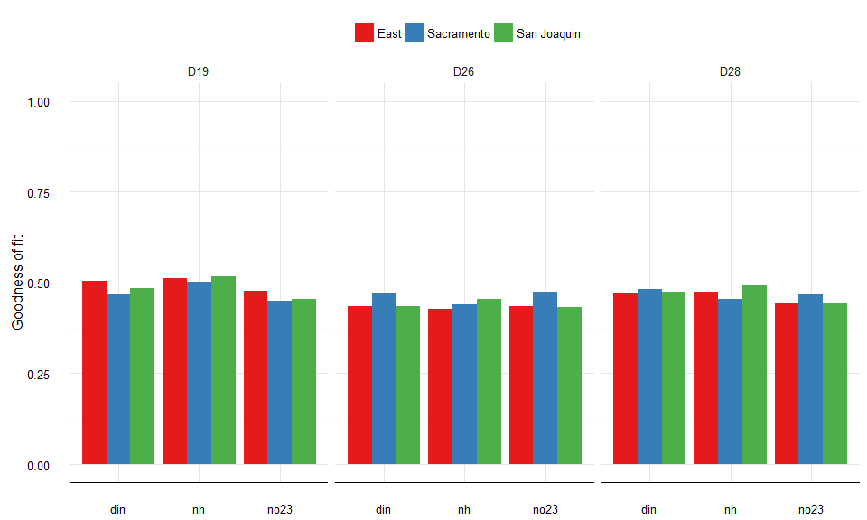

# Evaluation of middle delta stations
Marcus W. Beck, beck.marcus@epa.gov  

[Back to original page](http://fawda123.github.io/sf_trends/README)


### WRTDS predictions errors {.tabset}

Nitrogen models for three stations in the 'middle' Delta were evaluated using three different daily flow variables.  DIN, NO23, and NH4 were modelled at D19, D26, and D28 using daily flow estimates from the Sacramento, San Joaquin, and East time series.  Fits for conditional quantiles for each model are shown.  

#### 0.1

```r
load(file = 'data/middle_fits.RData')

# color vector
cols <- RColorBrewer::brewer.pal(9, 'Set1')[c(1, 2, 3)]

taus <- unique(middle_fits$tau)

for(tau in seq_along(taus)){
  
  toplo <- middle_fits[middle_fits$tau %in% taus[tau], ]
  
  p <- ggplot(toplo, aes(x = resvar, y = rmse, fill = flovar)) + 
    geom_bar(stat = 'identity', position = 'dodge') + 
    facet_wrap( ~ Site_Code, ncol = 3) + 
    theme_minimal() + 
    theme(
      axis.line.x = element_line(), 
      axis.line.y = element_line(),
      axis.title.x = element_blank(),
      legend.title = element_blank(), 
      legend.position = 'top'
      ) + 
    scale_y_continuous(limits = c(0, 0.9)) + 
    scale_fill_manual(values = cols)
  
  assign(paste0('p', tau), p)
 
}

print(p1)
```



#### 0.5


```r
print(p2)
```



#### 0.9


```r
print(p3)
```


